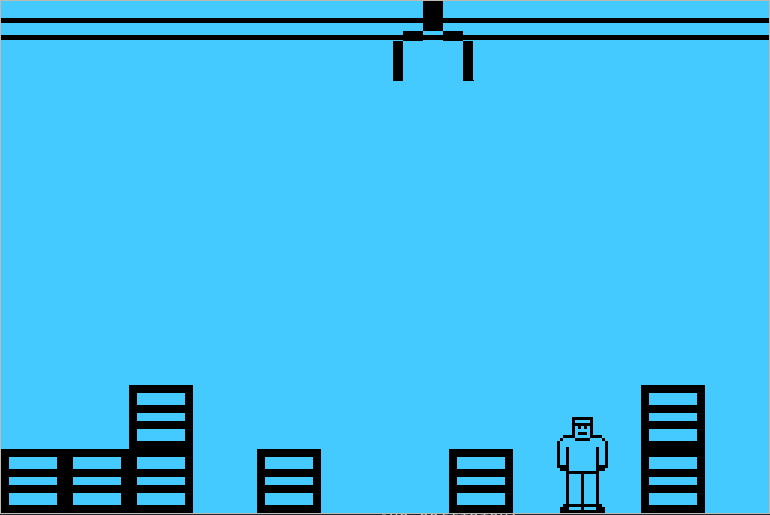

# Stack Attack Reborn 2020
This is a C++ version of the old discontinued clone of the Siemens A50 game Stack Attack.
 

## To-do list
- [X] Create Game class
- [X] Create Pipe class
- [X] Create Crane class
- [X] Create Block class
- [X] Add block-dropping system
- [X] Add block/block collision resolution
- [X] Add input handling (exit)
- [X] Add the player class
- [X] Add input handling (player horizontal movement)
- [X] Add animations
- [X] Add jumping
- [X] Add player-block collision    
- [ ] Resolve player-block collision
- [ ] Remove possible memory leaks

